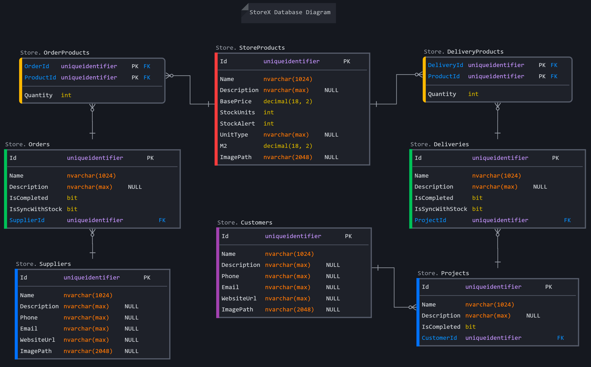

# StoreX - .NET 6 FullStack Web Application

**StoreX** is a **FullStack Web Application** (`WebAPI` + `Blazor WebAssembly`) written in **.NET 6** and built with [FullStackHero's Boilerplate](https://fullstackhero.net/) and [MudBlazor Components Library](https://mudblazor.com/).

It follows _Clean Architecture Principles_ and is composed of **two main repositories**:

- [**StoreX .NET 6 WebAPI**](https://github.com/rafitajaen/StoreX-WebAPI) (_Back-end_) : A RESTful API that meets _Swagger/OpenAPI Specs_ for CRUD, with non-read API calls secured with JWT. This API also includes _MultiTenancy support_ and _Users Authentication_.
- [**StoreX Blazor WebAssembly**](https://github.com/rafitajaen/StoreX-Blazor-Wasm) (_Front-end_) : A client side WASM application that consumes StoreX API thanks to NSwag Client Service Generator. It uses MudBlazor Components and implements _Localization_ for multilanguage support.

The **main purpose** of the application is to **support the management of a store** (or warehouse) as simply as possible.

It allows the user to manage _suppliers, orders, stock, customers, projects and deliveries_.

The app functions includes **alerts for product shortage**, and **teamwork is also possible** because the administrator can control the **roles and permissions** of each user.

## Personal Milestones

The aim of both repositories is to familiarise myself with the creation of a .NET 6 API, and to have a first approach to advanced concepts and implementations such as _Clean Coding Standards_, _JWT_, _Databases_ and _Multitenancy_.

- [x] Integrate my work into a project previously developed and ready for production.
  - [x] Use GitHub Forks and develop on a feature branch.
- [x] Follow Clean Architecture Principles.
- [x] Code First DataBase Creation.
  - [x] AutoSeed Database.
  - [x] Create [1:1], [1:n] and [n:n] relationships.
- [x] Approach to Domain Driven Design.
  - [x] Collaborate with a domain expert to interact with the fundamental concepts of the problem.
  - [x] Create Models, Requests, Specs, Responses (Dtos) and Controllers.
- [x] Master the use of MudBlazor for the creation of components.
- [x] Integrate API and Client togheter with the creation of an autogenerated OpenAPI Client Service.
- [ ] Use Azure DevOps for (CI/CD).
- [ ] Use Docker for self-host app.
- [ ] Tests.
- [x] Record the complete development progress of the application in a [CHANGELOG](./docs/CHANGELOG_STOREX.md).
- [x] Pushing myself to work in an English-only enviroment.

## Getting Started

You can **visit the LIVE Demo** : [StoreX - Store Management made simple](https://storex-app.azurewebsites.net/)

Also, if you are interested in checking the OpenAPI you can do so at the following link: [StoreX - OpenAPI](https://storex-web.azurewebsites.net/swagger)

or **run the app** in local by following next steps:

1. Make sure you have the API running. For that you have to clone StoreX Backend and run it.

   > git clone https://github.com/rafitajaen/StoreX-WebAPI.git

   > dotnet run --project src/Host

2. Open a new window in your IDE. Then clone StoreX Frontend and run it.

   > git clone https://github.com/rafitajaen/StoreX-Blazor-Wasm.git

   > dotnet run --project src/Host

3. You can find instructions on your terminal to open the application.

   > By default the app is running in https://localhost:5002

4. If you want to access to Swagger

   > By default it is in https://localhost:5001/swagger

5. The database is created and seeded automatically during first backend running.

   > A superadmin user is also created automatically.

6. You can login directly withour register.

   > Click in "FILL ADMINISTRATOR CREDENTIALS" (It is below "SIGN IN" button in Login Page)

7. If you cannot find it, you can fill it by yourself.

   > admin@root.com - 123Pa$$word! - root

## StoreX WebAPI Documentation

### The path that an `Entity` follows to become an `Endpoint`

Entity <-> Request (DTO) <- Handler (using Specs) -> Response (DTO) <-> EndPoint (Controller)

You can find the implementatios of:

- `Entities` in [src/Core/Domain/Store/](https://github.com/rafitajaen/StoreX-WebAPI/tree/storex/src/Core/Domain/Store)
- `Requests`, `Handlers`, `Specs` and `DTOs` in [src/Core/Application/Store/](https://github.com/rafitajaen/StoreX-WebAPI/tree/storex/src/Core/Application/Store)
- `Controllers` in [src/Host/Controllers/Store/](https://github.com/rafitajaen/StoreX-WebAPI/tree/storex/src/Host/Controllers/Store)

### StoreX Database Diagram

As you have read before, the main purpose of the application is to manage a store (or warehouse) in the easiest possible way.

This statement implies that the **product** is the centerpiece of the project, in this case we will name it `StoreProduct`.

> **Annotation**: In this project there are two different entities, `Product` and `StoreProduct`. The `Product` entity is a legacy of the original project and is not integrated in StoreX App, so you can ignore it.

We can separate the database design into three different parts:

- **Left side**: Related to the receipt of `StoreProducts` from a `Supplier`, through `Orders`.
- **Central**: Related to having the control of the `Stock`.
- **Right side**: Related to the `Delivery` of `StoreProducts` to a certain `Project`. Each `Project` belongs to a certain `Customer`.

    

### Context, Seeders, and Permissions

In case you need to consult the implementation of the other parts of the API:

- `Context` in [src/Infrastructure/Persistence/Context](https://github.com/rafitajaen/StoreX-WebAPI/blob/storex/src/Infrastructure/Persistence/Context/ApplicationDbContext.cs)
- `Seeder` in [src/Infrastructure/Persistence/Initialization/Store](https://github.com/rafitajaen/StoreX-WebAPI/tree/storex/src/Infrastructure/Persistence/Initialization)
- `Permissions` in [src/Core/Shared/Authorization](https://github.com/rafitajaen/StoreX-WebAPI/blob/storex/src/Core/Shared/Authorization/FSHPermissions.cs)

## StoreX WebAssembly Documentation

### User Authentication

StoreX is a multitenant application. This means that all users of the application share a single database between them.

This database is divided into fractions, which we can commonly call `Tenants`.

Each `Tenant` will have an administrator. This administrator will be in charge of granting `read`, `write`, `update` and `delete` permissions to the users.

A user can only access the data belonging to his tenant, through `Authentication` and `Permissions`.

In case you need to consult the implementation about Users Authentication:

- `/login` and `/users/self-register` in [src/Client/Pages/Authentication](https://github.com/rafitajaen/StoreX-Blazor-Wasm/tree/storex/src/Client/Pages/Authentication)

In order to provide a demo of the application, you can find a button called "**FILL ADMINISTRATOR CREDENTIALS**" in `/login` page, which automatically fills the login form with the credentials of the application's super administrator.

### Homepage and Sections

Once the user is authenticated, the sections of the application will be displayed in the drawer (on the left side) depending on the permissions that each specific user has been assigned.

The app has four main sections:

- **Start**
  - Home
  - Dashboard
- **Alerts**
  - Stock Alerts
- **Store Management**
  - Suppliers
  - Warehouse
  - Customers
- **Administration**
  - Logs
  - Users
  - Roles
  - Tenants

The **Start** section is related to the user's landing in the application. In **`Home`** page you can find a quick guide to start using the app, and other useful links about the project and the authors. You will also find the **`/dashboard`** page, where you can check the status of your database and the number of available entities at a glance.

The **Alerts** section is about products in a state of shortage. With a simple table, the user can quickly see which products in the warehouse need to be re-stocked, depending on the alerts that have been programmed. `Alerts` can be programmed here and on the warehouse page.

The **Store Management** section is where the magic happens. On the **`/suppliers`** page, the user can manage the `Orders` of each supplier. On the **`/warehouse`** page, the user can control the stock of each `Product` and set `Alarms` individually for each product. And finally, on the **`/customers`** page. The user can have control over the `Deliveries` made to each customer's `Project`.

Finally, in the **Administration** section, which is only available to users with an `Admin Role`. Here, you can access the logs, as well as manage users, roles and tenats of the application.

## License

This project is licensed with the [MIT license](LICENSE).

## Credits and Resource Links

I would not have managed to complete this project without the extensive knowledge of experienced colleagues sharing their knowledge out there. The following are items that were especially helpful during the creation of the application.

[C#10 and .NET 6 - Modern Cross-Platform Development](https://www.packtpub.com/product/c-10-and-net-6-modern-cross-platform-development-sixth-edition/9781801077361) by Mark J. Price

[Complete Blazor and ASP.NET API Development](https://www.udemy.com/course/end-to-end-aspnet-core-31-api-and-blazor-development/) by Trevoir Williams

[NET 6 JWT Authentication with example API](https://jasonwatmore.com/post/2021/12/14/net-6-jwt-authentication-tutorial-with-example-api) by Jason Watmore

[.NET Blazor Authentication and Role-Based Authentication](https://youtu.be/Yh16E2u2pio) by Patrick God

[ASP.NET Core WebAPI .NET 6 - One to Many Relationships](https://youtu.be/DWi-VHElmRE) by Teddy Smith

[Working with Forks](https://docs.github.com/en/pull-requests/collaborating-with-pull-requests/working-with-forks/about-forks)
